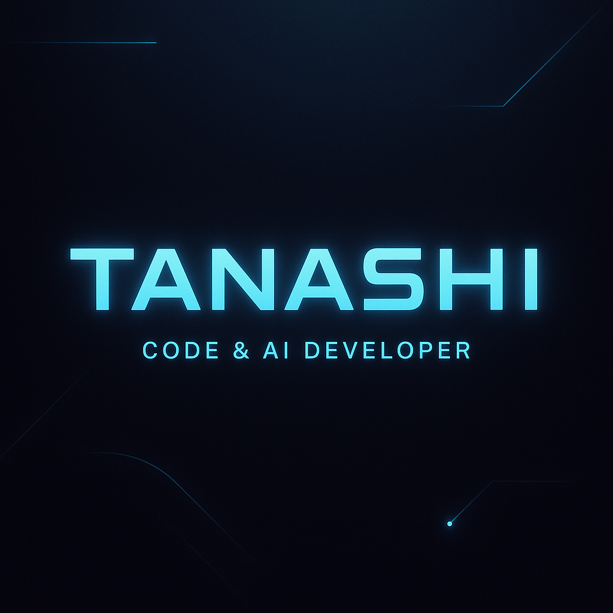

# profile-
profile repository

# 👋 Здрасти, аз съм Stefan Tananov (aka TANASHI)  

💻 **Aspiring Full-Stack & AI Developer**  
🎓 Student @ SoftUni | VIPe Coding | JS Front-End  
🚀 Интереси: Web Development, JavaScript, AI & Prompt Engineering  

---

## 🛠️ Технологии и умения
 
 
  
 
  
 
 
  

---

## 📜 Сертификати
- ✅ Programming Basics – September 2024 – 6.00  
- ✅ Programming Fundamentals with JavaScript – January 2025 – 6.00  
- ✅ JS Advanced – May 2025 – 6.00  
- ✅ JS Applications – June 2025 – 6.00  
- ✅ AI Basics – March 2025 – 6.00  
- ✅ Prompt Engineering – May 2025 – 6.00  
- ✅ AI for Images, Video & Audio – June 2025 – 6.00  
- ✅ AI for Education & Self-Education – July 2025 – 6.00  

---

## 📚 Предстоящи курсове
- 🚀 VIPe Coding (септември 2025)  
- 🚀 JS Front-End (септември 2025)  

---

## 📂 Проекти
- 🔗 [TANASHI To-Do App](#) – проста уеб апликация за задачи  
- 🔗 [SoftUni Projects](#) – решения и упражнения от курсовете  
- 🔗 [AI Experiments](#) – експерименти с OpenAI & AI проекти  

---

## 📫 Контакт
- GitHub: [github.com/StefanTananov](#)  
- Email: *тук можеш да добавиш свой имейл за проекти*  

---

⭐️ *„Keep learning, keep building.“* – **TANASHI**
